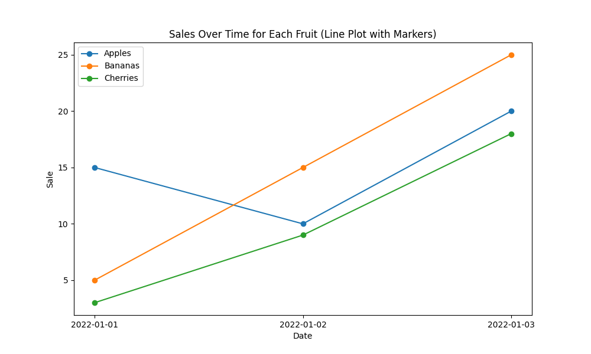

# Fruit Sales Analysis

This contains a Python script for analyzing and visualizing fruit sales over time. The script uses the Pandas library for data manipulation and Matplotlib for creating plots.

Data analysis is a crucial component in various fields and industries for several reasons. Here's a more detailed explanation of why data analysis is needed:

1.  **Informed Decision-Making:**
    
    -   **What it means:** Data analysis enables organizations to make informed decisions by extracting valuable insights from raw data.
    -   **Why it's needed:** Decision-makers can better understand patterns, trends, and correlations within their data, allowing them to make strategic and informed choices.
2.  **Identifying Trends and Patterns:**
    
    -   **What it means:** Data analysis helps in recognizing trends and patterns within datasets that might not be apparent at first glance.
    -   **Why it's needed:** Identifying trends can provide valuable insights into market dynamics, customer behavior, and other factors critical for business success.
3.  **Performance Measurement:**
    
    -   **What it means:** Organizations use data analysis to assess their performance against predefined metrics and goals.
    -   **Why it's needed:** Measuring performance helps in evaluating the effectiveness of strategies, campaigns, and overall business operations.
4.  **Customer Understanding:**
    
    -   **What it means:** Analyzing customer data allows businesses to understand customer preferences, behaviors, and needs.
    -   **Why it's needed:** This understanding is essential for tailoring products, services, and marketing strategies to meet customer expectations and enhance customer satisfaction.
5.  **Risk Management:**
    
    -   **What it means:** Data analysis assists in identifying and mitigating potential risks by evaluating historical data and predicting future outcomes.
    -   **Why it's needed:** Businesses can proactively manage risks, anticipate challenges, and implement strategies to minimize negative impacts.
6.  **Resource Optimization:**
    
    -   **What it means:** Data analysis helps in optimizing resource allocation, whether it's time, money, or personnel.
    -   **Why it's needed:** Efficient resource allocation ensures that organizations maximize their outputs while minimizing unnecessary costs.
7.  **Performance Monitoring and KPIs:**
    
    -   **What it means:** Key Performance Indicators (KPIs) are tracked and monitored through data analysis to measure the success of specific objectives.
    -   **Why it's needed:** Monitoring KPIs provides real-time feedback on the effectiveness of strategies and helps in making timely adjustments.
8.  **Market Research:**
    
    -   **What it means:** Data analysis is used in market research to understand market trends, consumer preferences, and competitive landscapes.
    -   **Why it's needed:** Businesses can stay competitive and adapt to changing market conditions by staying informed about industry trends and consumer behavior.

In summary, data analysis is essential for organizations to gain meaningful insights, make informed decisions, and stay competitive in today's data-driven world. It empowers businesses to understand their operations, customers, and market dynamics, leading to improved efficiency and better outcomes.

## Getting Started

Make sure you have the required libraries installed by running:

```bash
pip install pandas matplotlib
```

## Code explanation
we will be using .csv in this practice, you can get .csv file  from your database by using sample below code
```bash
import sqlite3
import csv

# Connect to the SQLite database
conn = sqlite3.connect('your_database.db')
cursor = conn.cursor()

# Execute a query to select data from a table
cursor.execute('SELECT * FROM your_table')

# Fetch all the results
data = cursor.fetchall()

# Define the CSV file name
csv_file = 'output.csv'

# Write the data to a CSV file
with open(csv_file, 'w', newline='') as file:
    csv_writer = csv
```
and here we have our CVS file that's being use
```bash
Fruit,Sale,Date

Apples,15,2022-01-01
Apples,10,2022-01-02
Apples,20,2022-01-03

Bananas,5,2022-01-01
Bananas,15,2022-01-02
Bananas,25,2022-01-03

Cherries,3,2022-01-01
Cherries,9,2022-01-02
Cherries,18,2022-01-03
```
here is our `sales.py` that does the analysis for the fruit sales
```bash
# Import the pandas library and alias it as 'pd'
import pandas as pd

# Import the pyplot module from matplotlib and alias it as 'plt'
import matplotlib.pyplot as plt

# Read the CSV file 'fruit_sale.csv' into a pandas DataFrame and assign it to the variable 'df'
df = pd.read_csv('fruit_sale.csv')

# Create a new figure with a specified size (10 inches by 6 inches)
plt.figure(figsize=(10, 6))

# Iterate over each unique fruit in the 'Fruit' column of the DataFrame
for fruit in df['Fruit'].unique():
    # Create a subset of the DataFrame for the current fruit
    fruit_data = df[df['Fruit'] == fruit]
    
    # Plot the sales over time for the current fruit, using markers ('o') and a label
    plt.plot(fruit_data['Date'], fruit_data['Sale'], marker='o', label=fruit)

# Add a label to the x-axis
plt.xlabel('Date')

# Add a label to the y-axis
plt.ylabel('Sale')

# Add a title to the plot
plt.title('Sales Over Time for Each Fruit (Line Plot with Markers)')

# Display a legend to distinguish between different fruits in the plot
plt.legend()

# Display the plot
plt.show()

```


This script reads a CSV file containing fruit sales data and then creates a line plot with markers to visualize the sales trends for each type of fruit over time.

## Result

The plot above illustrates the growth of sales for different fruits over the provided date range. Data Frame is created containing only the rows corresponding to that fruit type, and a line plot with markers is generated.

Here's an explanation of the result:

-   **Blue Line (Apple):**
    
    -   The blue line represents the sales over time for apples.
    -   Each marker on the blue line corresponds to a specific date, and the vertical position of the marker indicates the quantity of apples sold on that date.
-   **Orange Line (Banana):**
    
    -   The orange line represents the sales over time for bananas.
    -   Each marker on the orange line corresponds to a specific date, and the vertical position of the marker indicates the quantity of bananas sold on that date.
-   **Green Line (Cherry):**
    
    -   The green line represents the sales over time for cherries.
    -   Each marker on the green line corresponds to a specific date, and the vertical position of the marker indicates the quantity of cherries sold on that date.
-   **Reading the Plot:**
    
    -   The x-axis represents the dates (time), and the y-axis represents the quantity of sales.
    -   By looking at the markers on each line, you can easily see how many units of each fruit type were sold on a specific date.
    -   The legend on the plot helps identify which line corresponds to each fruit type.

For example, if you want to know how many apples were sold on January 2, you would look at the blue line at the position where it intersects with the date January 2 on the x-axis. Similarly, you can interpret the sales for bananas and cherries on each respective line.