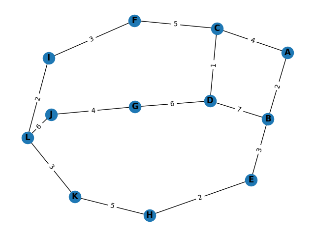

# Graph Visualization and Shortest Path Finder(map.py)

This Python script provides a `Graph` class for working with undirected graphs. It includes functionalities to add nodes and edges, find the shortest path between nodes using Dijkstra's algorithm, and visualize the graph using NetworkX and Matplotlib.

## Usage

1.  **Install Dependencies:**
    
    -   Ensure you have the required dependencies installed. You can install them using:
                
        ```bash
        pip install matplotlib networkx
        ``` 
        
2.  **Run the Script:**
    
    -   Copy the script (`map.py`) into your project.
    -   Customize the graph data in the JSON format within the script or load your own data.
3.  **Customize Graph Data:**
    
    -   Edit the `json_data` variable in the script to represent your graph. The JSON structure should include "nodes" and "edges" with corresponding details.
4.  **Create Graph and Find Shortest Path:**
    
    -   Instantiate the `Graph` class, add nodes and edges, and use the `dijkstra` method to find the shortest path between two nodes.
        
        
        ```python
        # Example:
        map_graph = Graph()
        map_graph.add_node("A")
        map_graph.add_edge("A", "B", 2)
        # ... add more nodes and edges ...
        shortest_distance, shortest_path = map_graph.dijkstra("A", "L")
        ``` 
        
5.  **Visualize the Graph:**
    
    -   Use the `visualize` method to display the graph with Matplotlib.
        
        pythonCopy code
        
        `map_graph.visualize()` 
        

## Example

An example graph is provided in the script. Run the script to visualize the graph and find the shortest path from node "A" to node "L."

```bash
# Run the script
python graph_visualization.py
```


# Social Media Network (social.py)

This Python program implements a simple social media network using the NetworkX library. The network allows users to be added, relationships to be formed between them, and provides functionality to find connections, analyze social circles, recommend new connections, and visualize the network.


## Features

1. **Adding Users:**
   - Users can be added to the social media network.

2. **Adding Relationships:**
   - Relationships between users (edges) can be added with specified relationship types.

3. **Finding Connections:**
   - Users can find their connections (neighbors) along with the relationship types.

4. **Analyzing Social Circles:**
   - The network can be analyzed to identify social circles using connected components.

5. **Recommendations:**
   - Users can receive recommendations for potential connections based on shared connections.

6. **Visualization:**
   - The network can be visualized using Matplotlib.

## Usage

 1. **Initialization:**
   ```python
   social_media_network = SocialMediaNetwork()
   ```
 
 2. **Adding Users and Relationships:**
   ```python
   social_media_network.add_user("User1")
   social_media_network.add_user("User2")
   social_media_network.add_relationship("User1", "User2", "Friend")
   ```
  
 3.  **Finding Connections:**
   ```python
   connections = social_media_network.find_connections("User1")
   print(f"Connections for User1: {connections}")
   ```
   
 4. **Analyzing Social Circles:**
   ```python
   social_circles = social_media_network.analyze_social_circles()
   user_social_circle = [circle for circle in social_circles if  "User1" in circle]
   print(f"Social Circles for User1: {user_social_circle if user_social_circle else 0}")
   ```
   
 5. **Recommendations:**
   ```python
   recommendations = social_media_network.recommend_connections("User1")
   print(f"Recommendations for User1: {recommendations}")
   ```
   
 6. **Visualization:**
   ```python
   social_media_network.visualize()
   ```
   